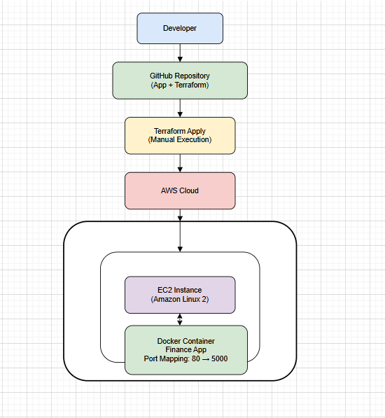
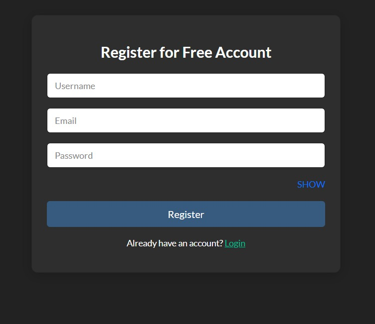

# Infrastructure as Code (IaC) Provisioning for Finance System

## 1. Introduction

This project demonstrates the implementation of Infrastructure as Code (IaC) for deploying a Finance application on AWS. The objective is to automate infrastructure provisioning and application deployment using modern DevOps practices.

The project integrates application development, containerization, cloud provisioning, and CI/CD automation into a single workflow.

---

## 2. Objectives

The main objectives of this project are:

- To automate infrastructure provisioning using Terraform
- To containerize the application using Docker
- To deploy the application on AWS EC2
- To implement CI/CD using GitHub Actions
- To eliminate manual configuration errors
- To ensure repeatable and scalable deployment

---

## 3. Technologies Used

- Python (Flask)
- Docker
- Terraform
- AWS (EC2, VPC, Subnet, Security Group, Internet Gateway)
- Git
- GitHub
- GitHub Actions

---

## 4. System Architecture Overview

The deployment workflow is as follows:

  

---

## 5. Infrastructure Components

The infrastructure is provisioned using Terraform and includes:

### 5.1 Virtual Private Cloud (VPC)
- CIDR Block: 10.0.0.0/16

### 5.2 Public Subnet
- CIDR Block: 10.0.1.0/24
- Configured to assign public IP automatically

### 5.3 Internet Gateway
- Attached to VPC for internet access

### 5.4 Route Table
- Configured to allow outbound internet traffic

### 5.5 Security Group
- Port 80 (HTTP) allowed from 0.0.0.0/0
- Port 22 (SSH) allowed from 0.0.0.0/0

### 5.6 EC2 Instance
- Instance Type: t3.micro
- Operating System: Amazon Linux
- Docker installed automatically using user-data script
- Finance application container deployed automatically

  

  
  
  

---

## 6. Application Layer

The Finance application is developed using Djnago (Python).

- The application runs on port 8000 inside the container.
- It is exposed on port 80 of the EC2 instance.

---

## 7. Containerization

The application is containerized using Docker.

Dockerfile performs the following steps:

- Uses official Python base image
- Copies application code
- Installs required dependencies
- Exposes port 8000
- Runs the application

Port Mapping:
EC2 Port 80 → Container Port 8000

  
  
  

---

## 8. CI/CD Implementation

Continuous Integration and Continuous Deployment are implemented using GitHub Actions.

The pipeline is triggered on every push to the main branch.

Pipeline Steps:

1. Checkout repository
2. Login to DockerHub
3. Build Docker image
4. Push Docker image to DockerHub
5. Run Terraform Init
6. Run Terraform Apply

This ensures automatic deployment without manual intervention.

---

## 9. Security Considerations

- AWS credentials are stored securely in GitHub Secrets.
- Docker credentials are stored securely in GitHub Secrets.
- Terraform state files are not pushed to the repository.
- Sensitive files are excluded using .gitignore.

---

## 10. Deployment Instructions

### 10.1 Local Application Execution

Using Python:
cd app
pip install -r requirements.txt
python app.py

Access at:
http://localhost:8000

Using Docker:
cd app
docker build -t finance-app .
docker run -p 8000:8000 finance-app

---

### 10.2 Infrastructure Deployment Using Terraform
cd terraform

terraform init

terraform apply

This provisions the AWS infrastructure and deploys the application automatically.

---

## 11. Output

After successful deployment, the application can be accessed via:

http://43.205.211.208

The application displays:

### 11.1 Login and Registration

  
  

---

### 11.2 Expense and Income Dashboard 

  
  

---

### 11.3 Expense and Income Summary

  
  

---

## 12. Conclusion

This project demonstrates the practical implementation of:

- Infrastructure as Code
- Containerization
- Cloud deployment
- CI/CD automation
- DevOps best practices

The solution ensures automated, consistent, and scalable deployment of the Finance application on AWS.

